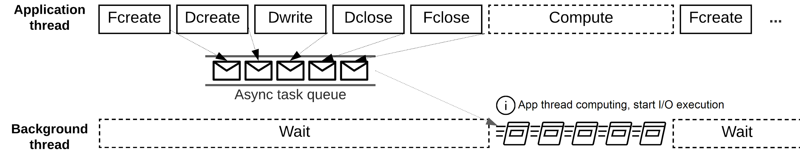

Background
==========

Asynchronous I/O enables an application executing the I/O operations at the same time as performing computation or communication tasks. By scheduling I/O operations early and overlapping them with computation or communication, asynchronous I/O can effectively hide the I/O cost and reduce the total execution time. The asynchronous I/O VOL connector (async VOL) uses background threads to execute HDF5 I/O operations. This work is supported by the DOE `ECP-ExaIO <https://www.exascaleproject.org/research-project/exaio>`_ project.

Citation
========
- Houjun Tang, Quincey Koziol, Suren Byna, and John Ravi, "Transparent Asynchronous Parallel I/O using Background Threads", IEEE Transactions on Parallel and Distributed Systems 33, no. 4 (2021): 891-902, doi: `10.1109/TPDS.2021.3090322 <https://www.doi.org/10.1109/TPDS.2021.3090322>`_.
- Houjun Tang, Quincey Koziol, Suren Byna, John Mainzer, and Tonglin Li, "Enabling Transparent Asynchronous I/O using Background Threads", 2019 IEEE/ACM Fourth International Parallel Data Systems Workshop (PDSW), 2019, pp. 11-19, doi: `10.1109/PDSW49588.2019.00006 <https://www.doi.org/10.1109/PDSW49588.2019.00006>`_.

Building with Spack
===================
`Spack <https://spack.io/>`_ is a flexible package manager that supports multiple versions, configurations, platforms, and compilers. Async VOL and its dependent libraries (MPI, HDF5, Argobots) can all be installed with the following spack command:

.. code-block::

   spack install hdf5-vol-async

Building from source code 
=========================
We have tested async VOL compiled with GNU (gcc 6.4+), Intel, and Cray compilers on Summit, Cori, Perlmutter, and Theta supercomputers.

Preparation
-----------
    Define the following configuration parameters, which may be used in the instructions. 

.. code-block::

    VOL_DIR : directory of HDF5 Asynchronous I/O VOL connector repository
    ABT_DIR : directory of Argobots source code
    H5_DIR  : directory of HDF5 source code

1. Download the async VOL with Argobots git submodule. Latest Argobots can also be downloaded separately from https://github.com/pmodels/argobots

.. code-block::

    git clone --recursive https://github.com/hpc-io/vol-async.git

2. Download the HDF5 source code

.. code-block::

    git clone https://github.com/HDFGroup/hdf5.git
    (Optional) git checkout hdf5-1_14_0 # use latest stable version

3. (Optional) Set the environment variables for the paths of the codes if the full path of ``VOL_DIR``, ``ABT_DIR``, and ``H5_DIR`` are used in later setup.

.. code-block::

    export H5_DIR=/path/to/hdf5
    export VOL_DIR=/path/to/vol_async
    export ABT_DIR=/path/to/vol_async/argobots

Build Async VOL
---------------

1. Compile HDF5
    HDF5 must be compiled with threadsafety support, and optionally parallel I/O support. CC=cc/CC=mpicc may needed in the following commands.

1.1 Using CMake

.. code-block::

    export HDF5_DIR=$H5_DIR/install
    cd hdf5
    mkdir build
    cd build
    cmake -DCMAKE_INSTALL_PREFIX=$HDF5_DIR -DHDF5_ENABLE_PARALLEL=ON -DHDF5_ENABLE_THREADSAFE=ON \
      -DALLOW_UNSUPPORTED=ON -DCMAKE_C_COMPILER=mpicc ..
    make -j && make install

1.2 Using Makefile

.. code-block::

    cd $H5_DIR
    ./autogen.sh
    ./configure --prefix=$H5_DIR/install --enable-parallel --enable-threadsafe --enable-unsupported 
    make && make install

2. Compile Argobots

.. code-block::

    cd $ABT_DIR
    ./autogen.sh
    ./configure --prefix=$ABT_DIR/install
    make && make install

.. note::
    Using mpixlC on Summit may result in an Argobots runtime error, use xlC or gcc instead.

3. Compile Asynchronous VOL connector

3.1 Using CMake

.. code-block::

    cd $VOL_DIR
    mkdir build
    cd build
    export HDF5_DIR=$H5_DIR/install
    cmake -DCMAKE_INSTALL_PREFIX=$VOL_DIR/install -DCMAKE_C_COMPILER=mpicc ..
    make && make install

3.2 Using Makefile

.. code-block::

    cd $VOL_DIR/src
    Prepare Makefile
        Copy a sample Makefile (Makefile.cori, Makefile.summit, Makefile.macos), e.g. "cp Makefile.summit Makefile", which should work for most linux systems
        Change the path of HDF5_DIR and ABT_DIR to $H5_DIR/install and $ABT_DIR/install (replace $H5_DIR and $ABT_DIR with their full path)
        (Optional) update the compiler flag macros: DEBUG, CFLAGS, LIBS, ARFLAGS
        (Optional) comment/uncomment the correct DYNLDFLAGS & DYNLIB macros
    make

Set Environmental Variables
---------------------------

Async VOL requires the setting of the following environmental variable to enable it with HDF5. Depending on which way Async VOL is compiled, the libh5async.so library file may be installed to $VOL_DIR/install/lib (CMake) or $VOL_DIR/src (Makefile), and should be set accordingly to the LD_LIBRARY_PATH and HDF5_PLUGIN_PATH.

*Linux*

.. code-block::

    export LD_LIBRARY_PATH=$VOL_DIR/install/lib:$H5_DIR/install/lib:$ABT_DIR/install/lib:$LD_LIBRARY_PATH
    export HDF5_PLUGIN_PATH="$VOL_DIR/install/lib"
    export HDF5_VOL_CONNECTOR="async under_vol=0;under_info={}" 

*MacOS*

.. code-block::

    export DYLD_LIBRARY_PATH=$VOL_DIR:$H5_DIR/install/lib:$ABT_DIR/install/lib:$DYLD_LIBRARY_PATH
    export HDF5_PLUGIN_PATH="$VOL_DIR/install/lib"
    export HDF5_VOL_CONNECTOR="async under_vol=0;under_info={}" 

.. note::
    For some Linux systems, e.g., Ubuntu, ``LD_PRELOAD`` needs to be set to point to the shared libraries.

Test
----

1. Compile and run test codes

1.1 Using CMake
    Tests are compiled by default when building async VOL with CMake. Running the tests can be done with the ctest command:

.. code-block::

    ctest

1.2 Using Makefile

.. code-block::
    cd $VOL_DIR/test
    Edit "Makefile":
        Copy a sample Makefile (Makefile.cori, Makefile.summit, Makefile.macos), e.g., "cp Makefile.summit Makefile", Makefile.summit should work for most linux systems
        Update H5_DIR, ABT_DIR and ASYNC_DIR to the correct paths of their installation directory
        (Optional) update the compiler flag macros: DEBUG, CFLAGS, LIBS, ARFLAGS
        (Optional) comment/uncomment the correct DYNLIB & LDFLAGS macro
    make

    // Run serial and parallel tests
    make check

    // Run the serial tests only
    make check_serial

If any test fails, check ``async_vol_test.err`` in the test directory for the error message. 

.. note::
    Running the automated tests requires Python3.

    If the system is not using mpirun to launch MPI tasks, edit mpirun_cmd in pytest.py with the corresponding MPI launch command.

    Some file systems do not support file locking, an error ``file create failed`` may occur and can be fixed with ``export HDF5_USE_FILE_LOCKING=FALSE``, which disables the HDF5 file locking. One can also disable HDF5 file locking when compiling HDF5.

Implicit mode
=============

This mode is only recommended for testing. The implicit mode allows an application to enable asynchronous I/O through setting the following environemental variables and without any major code change. By default, the HDF5 metadata operations are executed asynchronously, and the dataset operations are executed synchronously.

.. code-block::

    Set environment variables, :ref:`Set Environmental Variables`
    Run your application

.. note::
    Due to the limitations of the implicit mode, we highly recommend applications to use the explicit mode for the best I/O performance.

Explicit mode
=============

This mode is recommended to get the full benefits of async VOL, however, it requires application code changes to use the HDF5 asynchronous and event set APIs.

1. (Required) Set async VOL environment variables

See :ref:`Set Environmental Variables`

2. (Required) Init MPI with MPI_THREAD_MULTIPLE

Parallel HDF5 involves MPI collecive operations in many of its internal metadata operations, and they can be executed concurrently with the application's MPI operations, thus we require to initialize MPI with ``MPI_THREAD_MULTIPLE`` support. Change ``MPI_Init (argc, argv)`` in your application's code to:

.. code-block::

    MPI_Init_thread(argc, argv, MPI_THREAD_MULTIPLE, &provided);

3. (Required) Use event set and new async API to manage asynchronous I/O operations, see API section for a complete of APIs.

More detailed description on how to enable async VOL can be found in Hello Async Section.

.. code-block::

    // Create event set for tracking async operations
    es_id = H5EScreate();
    fid = H5Fcreate_async(.., es_id);
    did = H5Dopen_async(fid, .., es_id);
    H5Dwrite_async(did, .., es_id);
    H5Dclose_async(did, .., es_id);
    H5Fclose_async(fid, .., es_id);
    // Wait for operations in event set to complete
    H5ESwait(es_id, H5ES_WAIT_FOREVER, &num_in_progress, &op_failed); 
    // Close the event set (must wait first)
    H5ESclose(es_id);

.. warning::
    The buffers used for H5Dwrite can only be changed after H5ESwait unless async VOL double buffering is enabled, see subsection 5 below.

4. (Optional) Error handling with event set

Although it is listed as optional, it is highly recommended to integrate the asynchronous I/O error checking into the application code.

.. code-block::

    // Check if event set has failed operations (es_err_status is set to true)
    status = H5ESget_err_status(es_id, &es_err_status);
    // Retrieve the number of failed operations in this event set
    H5ESget_err_count(es_id, &es_err_count);
    // Retrieve information about failed operations 
    H5ESget_err_info(es_id, 1, &err_info, &es_err_cleared);
    // Inspect and handle the error if there is any
    ...
    // Free memory
    H5free_memory(err_info.api_name);
    H5free_memory(err_info.api_args);
    H5free_memory(err_info.app_file_name);
    H5free_memory(err_info.app_func_name);

5. (Optional) Async VOL double buffering

Applications may choose to have async VOL to manage the write buffer consistency. When enabled, async VOL will automatically makes a memory copy of the buffer for data writes. This increases the runtime memory usage but relieves the burden for the application to manage the double buffering. The copy is automatically freed after the background asynchronous write completes.

.. code-block::

    Add -DENABLE_WRITE_MEMCPY=1 to the end of the CFLAGS line in src/Makefile before compiling.

.. note::
    Async vol checks available system memory before its double buffer allocation at runtime, using get_avphys_pages() and sysconf().
    When there is not enough memory for duplicating the current write buffer, it will not allocate memory and force the current write to be synchronous.

With the double buffering enabled, users can also specify how much memory is allowed for async VOL to allocate, with can be set through an environment variable. When the limit is reached during runtime, async VOL will skip the memory allocation and execute the write synchronously, until previous duplicated buffers are freed after their operation compeleted.

.. code-block::

    export HDF5_ASYNC_MAX_MEM_MB=max_total_async_vol_memory_allocation_in_mb

6. (Optional) Include the header file if async VOL internal API is used (see Async VOL APIs section)
   This is rarely needed by an application.

.. code-block::

    #include "h5_async_vol.h" 

7. (Optional) Finer control of asynchronous I/O operation

When async VOL is enabled, each HDF5 operation is recorded and put into a task queue and returns without actually executing it. The async VOL detects whether the application is busy issuing HDF5 I/O calls or has moved on to other tasks (e.g., computation). If it finds no HDF5 function is called within a short period (600 ms by default), it will start the background thread to execute the tasks in the queue. This is mainly due to the global mutex from the HDF5, allowing only one thread to execute the HDF5 operations at a given time to maintain its internal data consistency. 

The application status detection can avoid an effectively synchronous I/O when the application thread and the async VOL background thread acquire the mutex in an interleaved fashion. However, some applications may have larger time gaps between HDF5 function calls and experience partially asynchronous behavior. To mitigate this, we provide a way by setting an environment variable that informs async VOL to queue the operations and not start their execution until file/group/dataset close time. 

When set properly, it make async VOL especially effective for applications that periodically output (write-only) data, e.g., writing checkpoint files periodically.

.. code-block::

    // Start execution at file close time
    export HDF5_ASYNC_EXE_FCLOSE=1
    // Start execution at group close time
    export HDF5_ASYNC_EXE_GCLOSE=1
    // Start execution at dataset close time
    export HDF5_ASYNC_EXE_DCLOSE=1

Async VOL has overhead to manage the asynchronous I/O tasks, and if an application issues a large number of small I/O operations (e.g. scalar attribute create, write, close), the async VOL overhead may be comparable to those operations, and thus resulting in slower I/O performance. We provide an option to disable the asynchronous execution of the small I/O operations and only execute the dataset operations asynchronously, by setting the following environment variable: 

.. code-block::
   export HDF5_ASYNC_DISABLE_IMPLICIT_NON_DSET_RW=1

