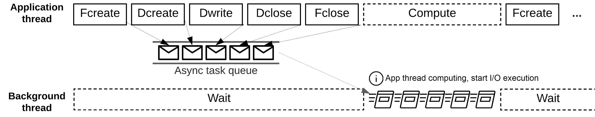

.. HDF5 Asynchronous I/O VOL Connector documentation master file, created by
   sphinx-quickstart on Mon Jul  5 23:54:03 2021.
   You can adapt this file completely to your liking, but it should at least
   contain the root `toctree` directive.

HDF5 Asynchronous I/O VOL Connector
===================================

Asynchronous I/O enables an application executing the I/O operations at the same time as performing computation or communication tasks. By scheduling I/O operations early and overlapping them with computation or communication, asynchronous I/O can effectively hide the I/O cost and reduce the total execution time. 

The HDF5 Asynchronous I/O VOL connector maintains a queue of asynchronous tasks and tracks their dependencies as a directed acyclic graph, where a task can only be executed when all its parent tasks have been completed successfully. Collective operations are executed in the same order as in the application, in an ordered but asynchronous manner. To reduce overhead and avoid contention for shared resources between an application's main thread and the background thread that performs the asynchronous I/O operations, we use a status detection mechanism to check when the main thread is performing non-I/O tasks. We also provide an EventSet interface in HDF5 to monitor asynchronous operation status and to check errors for a set of operations instead of individual ones.

This work is supported by the DOE `ECP-ExaIO <https://www.exascaleproject.org/research-project/exaio>`_ project.

Citation
========
- Houjun Tang, Quincey Koziol, Suren Byna, and John Ravi, "Transparent Asynchronous Parallel I/O using Background Threads", IEEE Transactions on Parallel and Distributed Systems 33, no. 4 (2021): 891-902, doi: `10.1109/TPDS.2021.3090322 <https://www.doi.org/10.1109/TPDS.2021.3090322>`_.
- Houjun Tang, Quincey Koziol, Suren Byna, John Mainzer, and Tonglin Li, "Enabling Transparent Asynchronous I/O using Background Threads", 2019 IEEE/ACM Fourth International Parallel Data Systems Workshop (PDSW), 2019, pp. 11-19, doi: `10.1109/PDSW49588.2019.00006 <https://www.doi.org/10.1109/PDSW49588.2019.00006>`_.

.. toctree::
   :maxdepth: 2
   :caption: Getting Started

   gettingstarted

.. toctree::
   :maxdepth: 2
   :caption: Async I/O API

   hdf5api
   asyncapi

.. toctree::
   :maxdepth: 1
   :caption: Hello Async I/O

   example

.. toctree::
   :maxdepth: 1
   :caption: Best Practices

   bestpractice
   debug

.. toctree::
   :maxdepth: 1
   :caption: Known Issues

   issue

.. toctree::
   :maxdepth: 2
   :caption: Legal

   copyright
   license

Indices and tables
==================

* :ref:`genindex`
* :ref:`modindex`
* :ref:`search`
